# 个人博客管理后台

`blog-admin` 是基于 React 19 + Vite 6 + TypeScript 构建的个人博客管理后台。集成 Ant Design 5 UI 组件库和 UnoCSS 原子化 CSS 引擎，采用 pnpm monorepo 架构管理。

支持博客文章的增删改查、分类标签管理、博主信息维护等功能，提供完善的权限管理、主题定制、国际化等企业级功能。


> 博客在线预览 https://pzhdv.cn

### 项目仓库
- 前端：https://github.com/pzhdv/blog
- 前端 API：https://github.com/pzhdv/blog-api
- 后台管理：https://github.com/pzhdv/blog-admin
- 后台 API：https://github.com/pzhdv/blog-admin-api

---

### 🎯 核心优势

- 🎯 **技术先进** — 采用最新前端技术栈，紧跟技术潮流
- 💪 **功能完善** — 博客管理、博主信息、系统设置一站式解决方案
- 🏗️ **架构清晰** — 分层架构、模块化设计、完善的 TypeScript 类型支持
- ✨ **体验流畅** — 细腻的动画效果、直观的用户界面

---

## 🔧 技术栈

| 分类 | 技术 | 说明 |
|-----|------|------|
| 框架 | React 19 | 最新的 React 版本，享受最前沿的特性 |
| 构建 | Vite 6 | 极速的开发构建工具 |
| 语言 | TypeScript 5.7 | 完善的类型系统 |
| 状态管理 | Redux Toolkit | 现代化的状态管理方案 |
| 服务端状态 | TanStack Query 5 | 强大的服务端状态管理方案 |
| UI 组件 | Ant Design 5.24 | 企业级 UI 组件库 |
| CSS | UnoCSS | 高性能的原子化 CSS 引擎 |
| 路由 | React Router V7 | 强大的路由管理系统 |
| 包管理 | pnpm monorepo | 高效的包管理方案 |
| 国际化 | i18next | 国际化框架 |
| 动画 | Motion | 流畅的动画系统 |
| 图表 | ECharts | 数据可视化图表库 |

---

## 🗂️ Monorepo 架构

项目采用 pnpm workspace 管理，包含以下子包：

| 包名 | 说明 |
|-----|------|
| @sa/axios | 封装的 HTTP 请求库，支持拦截器、错误处理等 |
| @sa/color | 主题颜色处理工具库 |
| @sa/hooks | 常用 React Hooks 集合 |
| @sa/materials | 通用组件库 |
| @sa/scripts | 命令行工具集 |
| @sa/utils | 通用工具函数库 |
| @sa/uno-preset | UnoCSS 自定义预设配置 |

---

## 🌟 项目特点

- **代码质量** — 代码规范严谨，架构清晰优雅，完善的 TypeScript 类型支持
- **开箱即用** — 无需复杂配置，快速启动项目开发
- **约定式路由** — 自动化的文件路由系统，类似 Next.js 的开发体验
- **分层架构** — 分层清晰的 Service 层架构，URL、Keys、Hooks 分离
- **权限管理** — 基于角色的权限控制系统（RBAC）
- **主题系统** — 支持暗黑模式、多主题色、布局配置等
- **国际化** — 完整的 i18n 方案，支持多语言切换
- **Keep-Alive** — 页面缓存功能，提升用户体验
- **动画效果** — 基于 Motion 的流畅动画系统

---

## 📸 功能截图
### 登录
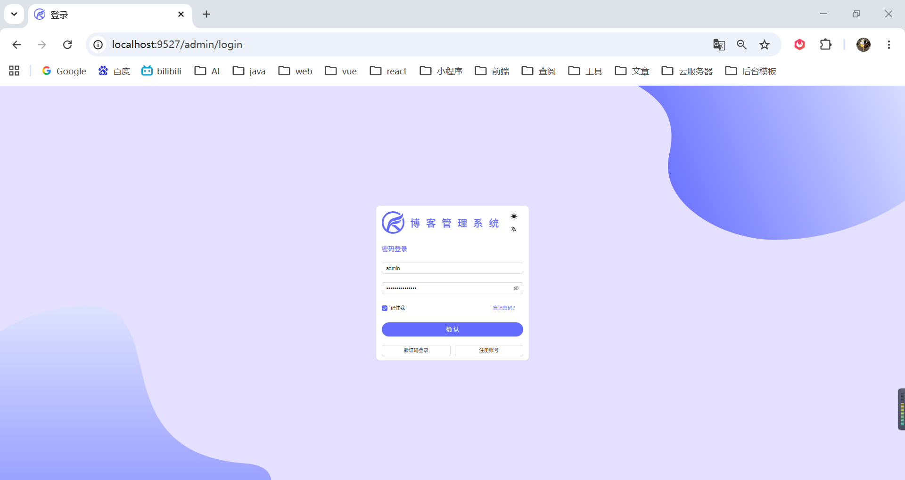

### 📌 基本介绍
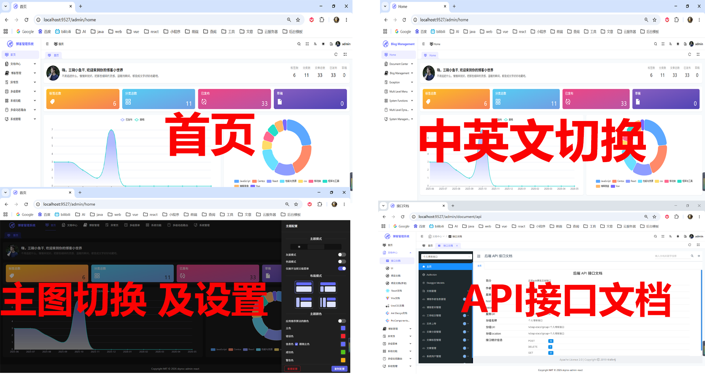

#### ⚙️ 系统管理
##### 📋 菜单权限页面
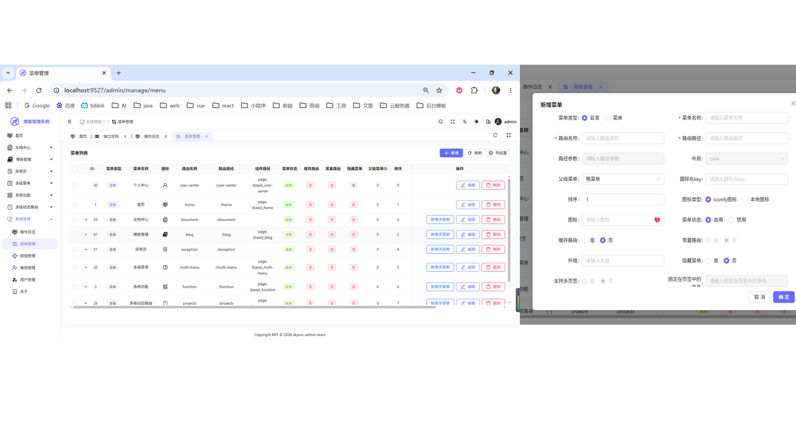

##### 🔐 系统权限按钮
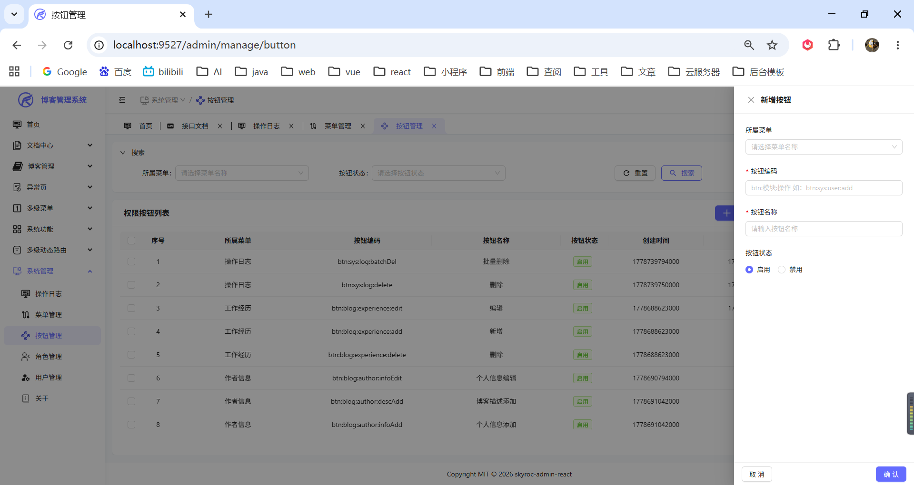

##### 👥 系统角色
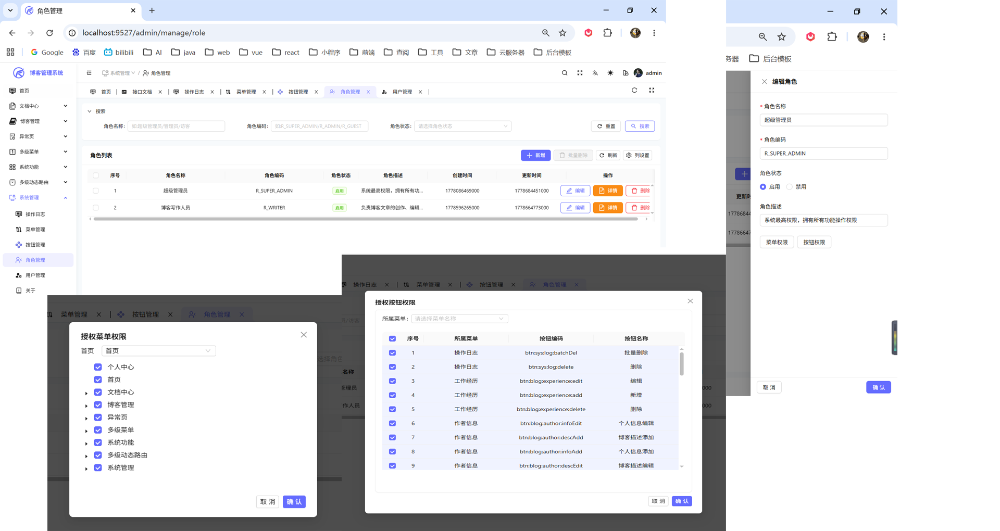

##### 👤 系统用户
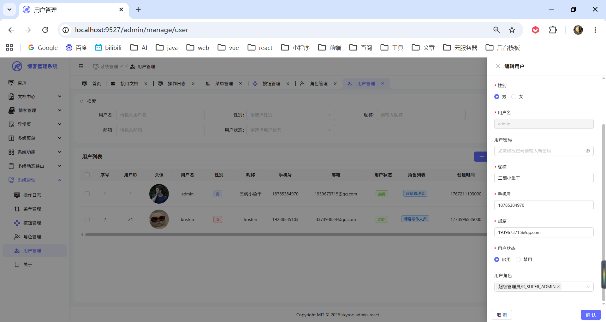

##### 📝 操作日志
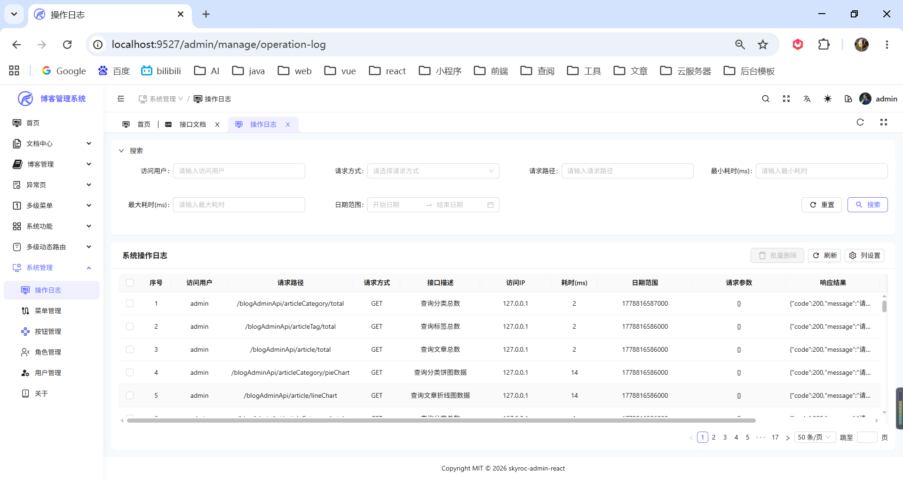

### 📝 博客管理

#### 📂 文章分类
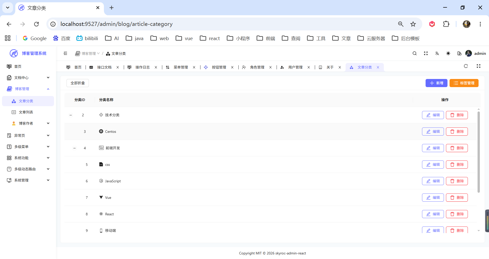
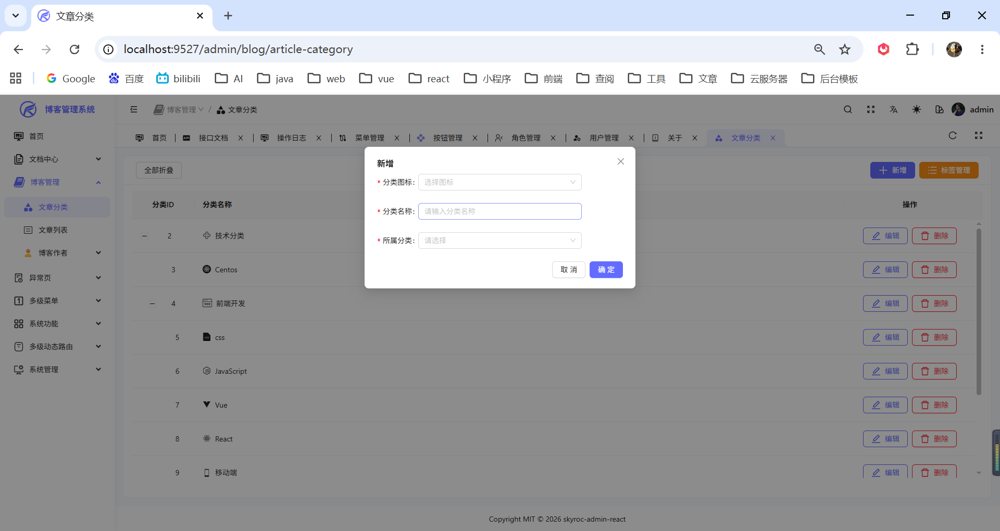
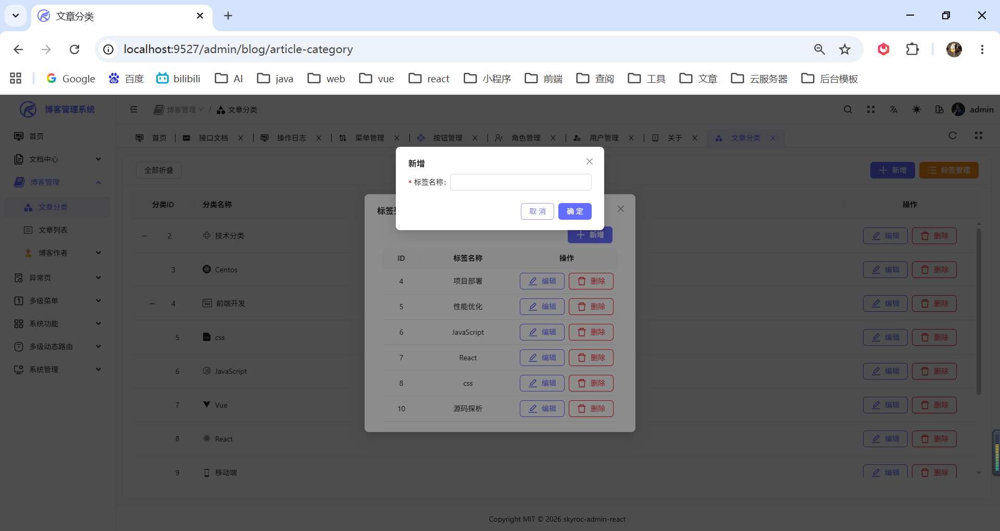

#### 📄 文章列表
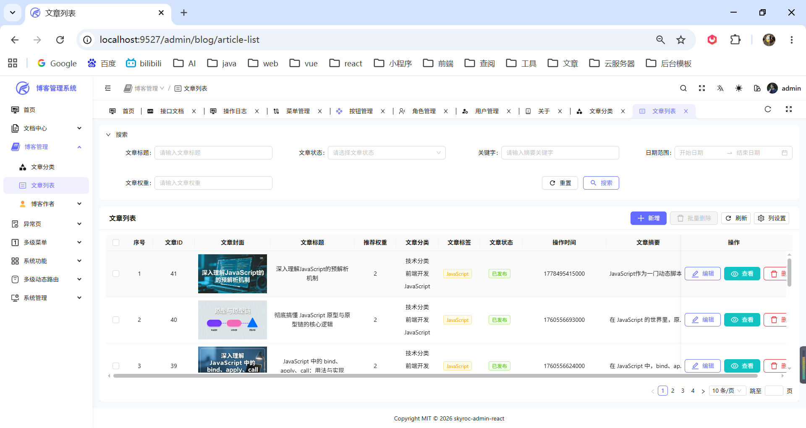
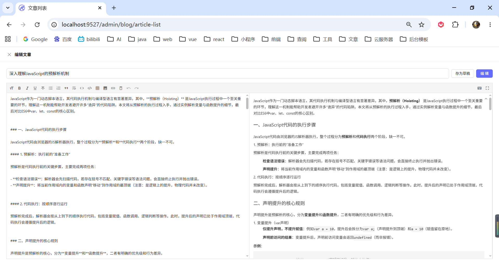
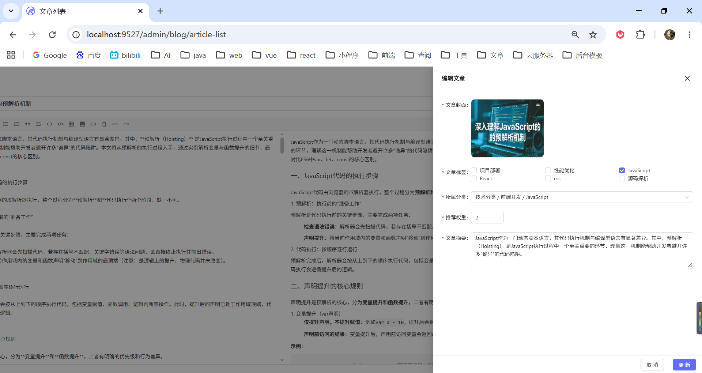

#### ✍️ 博客作者

##### 💼 工作经验
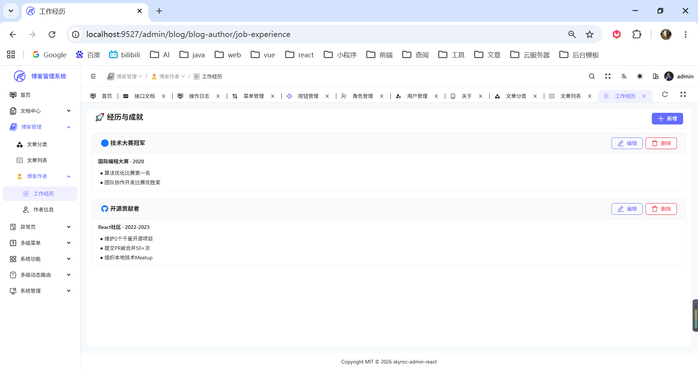
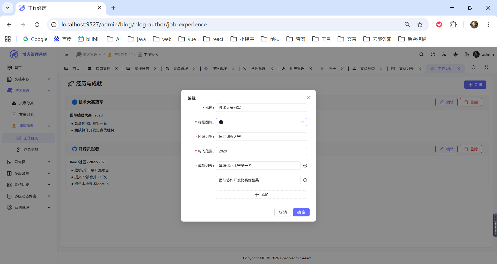

##### 👨‍💻 作者信息
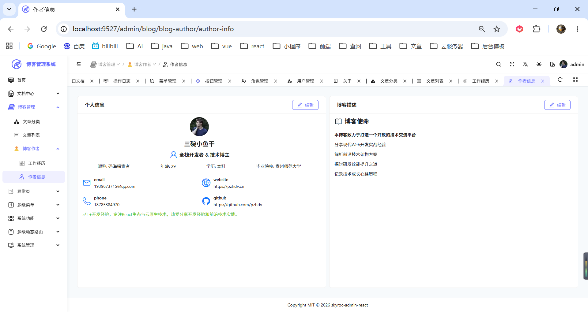
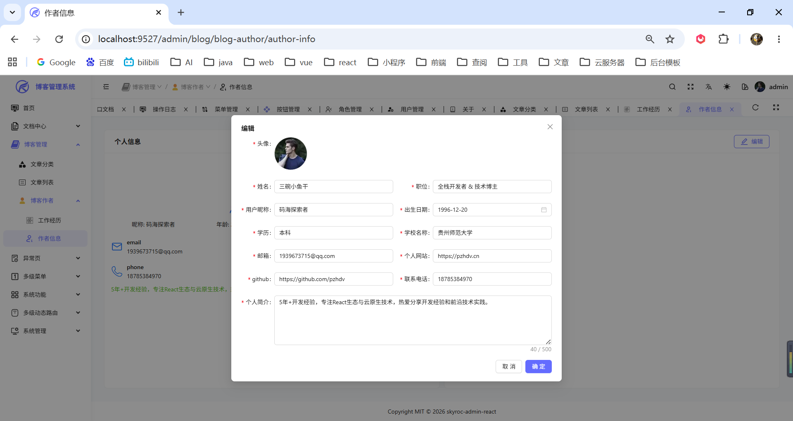
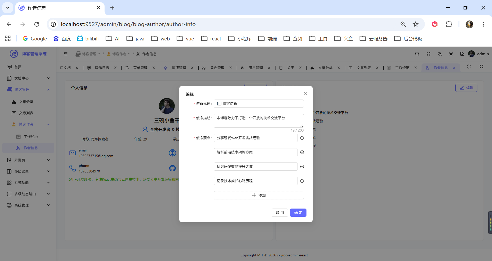

### ⚠️ 系统异常

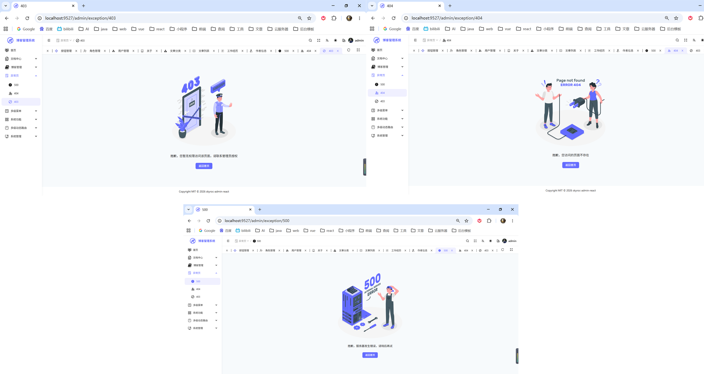

### 🔒 权限页面

> 采用 RBAC 角色权限控制，不同角色分配不同菜单与按钮权限；拦截浏览器地址栏非法路由访问，越权请求自动跳转 403 无权限页面。

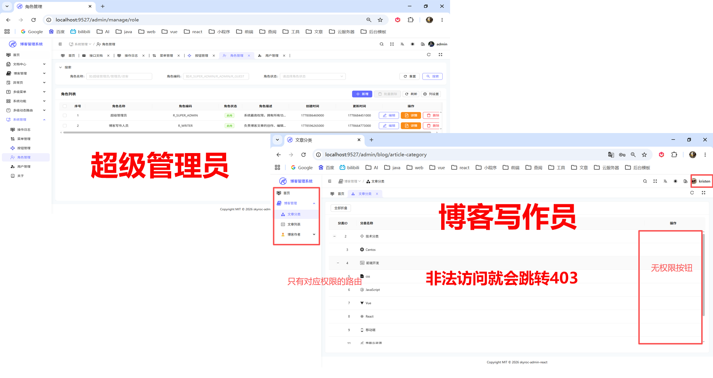

---

## 🗂️ 项目结构

```
blog-admin/
├── packages/                      # 内部包 (Monorepo)
│   ├── axios/                     # @sa/axios - HTTP 请求封装
│   ├── color/                     # @sa/color - 主题颜色处理
│   ├── hooks/                     # @sa/hooks - React Hooks 集合
│   ├── materials/                 # @sa/materials - 通用物料组件
│   ├── scripts/                   # @sa/scripts - 命令行工具
│   ├── uno-preset/                # @sa/uno-preset - UnoCSS 预设
│   └── utils/                     # @sa/utils - 通用工具函数
├── src/
│   ├── components/                # 公共组件
│   │   ├── AuthBtn.tsx           # 权限按钮组件
│   │   ├── BetterScroll.tsx      # 滚动条组件
│   │   ├── Buttons/               # 按钮组件库
│   │   ├── ErrorBoundary.tsx     # 错误边界
│   │   ├── IconSelect.tsx        # 图标选择器
│   │   ├── MarkdownEditor.tsx    # Markdown 编辑器
│   │   ├── SvgIcon.tsx           # SVG 图标组件
│   │   ├── SystemLogo.tsx        # 系统 Logo
│   │   └── UploadImage/          # 图片上传组件
│   ├── config.ts                 # 全局配置
│   ├── constants/                # 常量定义
│   ├── features/                 # 功能模块
│   │   ├── auth/                # 认证模块
│   │   ├── lang/                # 国际化模块
│   │   ├── menu/                # 菜单模块
│   │   ├── router/              # 路由模块
│   │   ├── tab/                 # 标签栏模块
│   │   ├── table/               # 表格模块
│   │   └── theme/               # 主题模块
│   ├── hooks/                    # 业务 Hooks
│   ├── layouts/                  # 布局组件
│   ├── locales/                  # 国际化语言包
│   ├── pages/                    # 页面
│   │   ├── (base)/              # 基础页面
│   │   │   ├── blog/           # 博客管理
│   │   │   ├── function/       # 功能演示
│   │   │   ├── home/           # 首页
│   │   │   ├── manage/         # 系统管理
│   │   │   ├── multi-menu/     # 多级菜单
│   │   │   ├── projects/       # 项目管理
│   │   │   └── user-center/    # 用户中心
│   │   ├── (blank)/            # 空白布局页面
│   │   │   └── login/          # 登录相关
│   │   └── _builtin/           # 内置页面
│   ├── router/                   # 路由配置
│   ├── service/                   # 服务层 (API)
│   │   ├── api/                 # API 接口定义
│   │   ├── hooks/              # 服务层 Hooks
│   │   ├── keys/               # 请求 Key 管理
│   │   ├── request/            # 请求封装
│   │   └── urls/               # URL 管理
│   ├── store/                   # Redux Store
│   ├── styles/                  # 全局样式
│   ├── types/                   # TypeScript 类型
│   └── utils/                   # 工具函数
├── build/                        # 构建配置
├── public/                       # 静态资源
├── vite.config.ts                # Vite 配置
├── uno.config.ts                 # UnoCSS 配置
├── tsconfig.json                 # TypeScript 配置
└── pnpm-workspace.yaml          # pnpm 工作区配置
```

---

### 🔑 安装 & 启动

### 🌟 环境要求

- 🟢 **Node.js**: >= 18.12.0
- 📦 **pnpm**: >= 8.7.0

### 📥 依赖安装

```bash
# 使用 pnpm 安装（推荐）
pnpm install
```

### 🖥️ 开发环境

```bash
# 启动开发服务（测试环境）
pnpm dev

# 启动开发服务（生产环境）
pnpm dev:prod
```

> ⚡ 开发服务默认运行在 `http://localhost:9527`，浏览器自动打开。

### 📦 构建部署

```bash
# 打包生产环境
pnpm build

# 打包测试环境
pnpm build:test
```

### 👀 预览结果

```bash
# 本地预览打包结果（默认端口 9725）
pnpm preview
```

---

## 🛠 其他指令

| ⌨️ 命令            | 📝 说明                    |
| ----------------- | ------------------------- |
| `pnpm lint`       | ESLint 代码检查并自动修复 |
| `pnpm typecheck`  | TypeScript 类型检查       |
| `pnpm gen-route`  | 自动生成路由配置          |
| `pnpm cleanup`    | 清理缓存、dist、日志文件  |
| `pnpm commit`     | 中文规范 Git 提交         |
| `pnpm commit:en`  | 英文规范 Git 提交         |
| `pnpm release`    | 一键发版、自动打标签      |
| `pnpm update-pkg` | 一键更新所有依赖包版本    |

---

## 📜 许可证

本项目采用 MIT 许可证 - 查看 [LICENSE](LICENSE) 文件了解详情

---

## 👨‍💻 作者

🧩 姓名：潘宗晖（PanZonghui）

🌐 博客: [https://pzhdv.cn](https://pzhdv.cn/)

📧 邮箱: [1939673715@qq.com](mailto:1939673715@qq.com)

🐙 GitHub: [https://github.com/pzhdv](https://github.com/pzhdv)

---

## 🙏 致谢

感谢以下开源项目的贡献：

💖 [skyroc-admin](https://github.com/ohh-889/skyroc-admin) — 项目基础框架

💖 [skyroc-admin-react](https://github.com/pzhdv/skyroc-admin-react) — 项目基础框架

🦆 [Ant Design](https://ant.design/) — 蚂蚁金服 UI 组件库

⚡ [Vite](https://vitejs.dev/) — 下一代前端构建工具

⚛️ [React](https://react.dev/) — 用于构建用户界面的 JavaScript 库

📘 [TypeScript](https://www.typescriptlang.org/) — JavaScript 的超集

🛠️ [Redux Toolkit](https://redux-toolkit.js.org/) — Redux 标准工具集

🔄 [TanStack Query](https://tanstack.com/query) — 强大的异步状态管理

---

如果这个项目对你有帮助，请给个 ⭐ Star 支持一下！